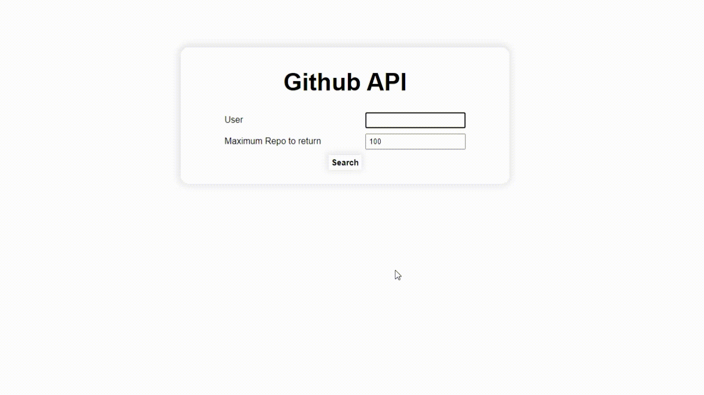

<p align="center">
  <a href="https://rohit19060.github.io/Github-API/" title="Github API">
    
  </a>
</p>
<h1 align="center">🌟 Github API 🌟</h1>
<p align="center">App to get all the repo of any user just by their Github username</p>

<p align="center">
<a href="https://github.com/rohit19060/Github-API/blob/master/LICENSE" title="License">

</a>
<a href="https://github.com/rohit19060/Github-API/fork" title="Forks">

</a>
<a href="https://github.com/rohit19060/Github-API/stargazers" title="Stars">

</a>
<a href="https://github.com/rohit19060/Github-API/issues" title="Issues">

</a>
<a href="https://github.com/rohit19060/Github-API/pulls" title="Pull Requests">

</a>
<a href="https://github.com/rohit19060/Github-API" title="Repo Size">

</a>
<a href="https://discord.gg/sDDHTPs97M" title="Join Community">

</a>
<a href="https://open.vscode.dev/Rohit19060/Github-API" title="Open in VSCode">

</a>
<a href="https://github.dev/Rohit19060/Github-API" title="Open in VSCode Web">

</a>
</p>

<p align="center" title="Github API"></p>

<h2 align="center">🌐 Links 🌐</h2>
<p align="center">
    <a href="https://github.com/rohit19060/Github-API" title="Github API">📂 Repo</a>
    ·
    <a href="https://rohit19060.github.io/Github-API/" title="Github API">✨ Live View</a>
    ·
    <a href="https://api.github.com/" title="Github API">🛳 API</a>
    ·
    <a href="https://github.com/rohit19060/Github-API/issues/new/choose" title="🐛Report Bug/🎊Request Feature">🚀 Got Issue</a>
</p>

## 🚀 Features

Just give it a Github Username and hit the Submit Button

- **Get all Repository**

- **Repo Limiter**

## 🦋 Prerequisite

- Basic Understanding of [HTML](https://youtu.be/JHv2jmnrLlA "HTML - First Step Towards Web Development")

- Basic Understanding of [CSS](https://youtu.be/d1tP7ow7HbQ "CSS - Second Step Towards Web Development")

- Basic Understanding of JavaScript

## 🛠️ Installation Steps

1. Clone the repository

```Bash
git clone https://github.com/rohit19060/Github-API.git
```

2. Change the working directory

```Bash
cd Github-API
```

3. Run `index.html` file in any browser

**🎇 You are Ready to Go!**

## ❗ Run

It is a very simple web app, you just need to run the `index.html` file on your browser

## 👷 Built with

- [HTML](https://youtu.be/JHv2jmnrLlA "HTML - First Step Towards Web Development"): For Creating Markup

- [CSS](https://youtu.be/d1tP7ow7HbQ "CSS - Second Step Towards Web Development"): For Designing

- JavaScript: For Writing scripts to get the repos

- [Github API](https://api.github.com/ "Github API"): API to make the call and get repo list as a response

## 📂 Directory Structure

> [`index.html`](https://github.com/Rohit19060/Github-API/blob/main/index.htm "Github API"): Main entry point of application

> [`style.css`](https://github.com/Rohit19060/Github-API/blob/main/style.css "Style"): Contains all the styles of the app

> [`script.js`](https://github.com/Rohit19060/Github-API/blob/main/script.js "Script"): Contains all the script to make the request and get a response

> [`jquery.js`](https://github.com/Rohit19060/Github-API/blob/main/jquery.js "jQuery"): To make things easier we are using jquery

## 🎊 Future Updates

- [ ] Add Other Github Functionality

## 🧑🏻 Author

**Rohit Jain**

- 🌌 [Profile](https://github.com/Rohit19060 "Rohit Jain")

- 🏮 [Email](mailto:rohitjain19060@gmail.com?subject=Hi%20from%20Github%20API "Hi!")

- 🦁 [Website](https://kingtechnologies.in "Welcome")

<h2 align="center">🤝 Support</h2>

<p align="center">🎀 Contributions (<a href="https://guides.github.com/introduction/flow" title="GitHub flow">GitHub flow</a>), 🔥 issues, and 🥮 feature requests are most welcome!</p>

<p align="center">💙 If you like this project, Give it a ⭐ and Share it with friends!</p>
<p align="center">💰 Donations Links</p>
<p align="center">
<a href="https://www.paypal.me/kingrohitJ" title="PayPal"></a>
<a href="https://www.buymeacoffee.com/rohitjain" title="Buy me a Coffee"></a>
<a href="https://ko-fi.com/rohitjain" title="Ko-fi"></a>
<a href="https://www.patreon.com/KingTechnologies" title="Patreon"></a>
</p>

<p align="center">Made with JavaScript & ❤️ in India</p>
